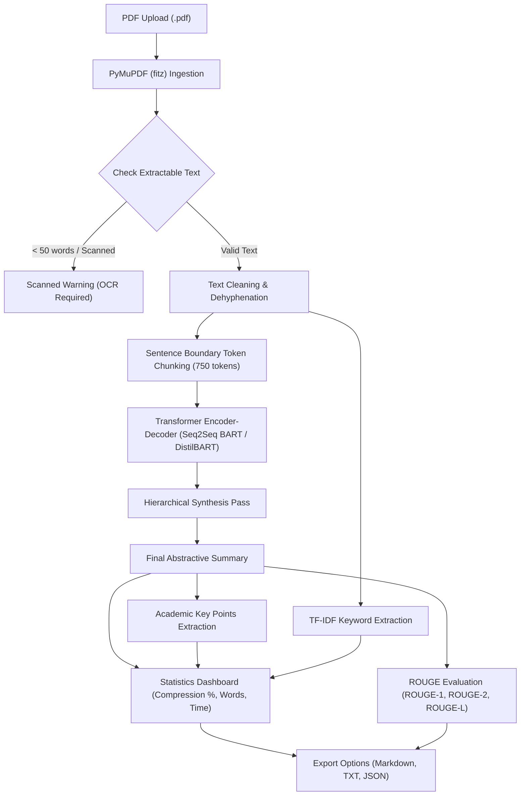

# 📚 Research Paper Summarizer

> **AI-Powered Academic Research Paper Summarization using Transformer-Based NLP**  
> *Developed for AI Lab Academic Mini-Project (CSE / AI & Data Science)*

---

## 📖 Abstract

In the contemporary research ecosystem, thousands of scientific papers are published weekly across computer science, engineering, and biomedicine. Synthesizing dense, multi-page academic literature requires significant cognitive effort and time. 

The **Research Paper Summarizer** is an automated Natural Language Processing (NLP) system designed to extract, clean, partition, and summarize academic research papers from PDF documents. Leveraging state-of-the-art pretrained sequence-to-sequence (Seq2Seq) Transformer architectures (**BART / DistilBART**), the application generates concise, grammatically coherent abstractive summaries while extracting core factual takeaways, technical domain keywords, and quantitative compression statistics. The system also features a rigorous **ROUGE** evaluation dashboard to objectively measure summary quality against human-authored ground truth abstracts.

---

## ✨ Features

- **Automated PDF Parsing & Extraction:** Extracts structured text and layout information page-by-page using PyMuPDF (`fitz`).
- **Metadata Detection:** Heuristically extracts paper title, authors, page counts, and total word volume.
- **Scanned PDF & OCR Advisory:** Detects image-only scans or unselectable documents and issues graceful user advisories rather than crashing.
- **Academic Text Preprocessing:** Normalizes line breaks, dehyphenates wrapped technical words (e.g. `trans-\nformer` $\to$ `transformer`), and strips arXiv headers while strictly preserving mathematical notation, citations, and formulas.
- **Token-Aware Hierarchical Chunking:** Overcomes the quadratic $O(N^2)$ positional embedding bottleneck ($1024$ tokens) of Transformer models through sentence-bounded overlapping chunking.
- **Pretrained Abstractive Summarization:** Uses Hugging Face Transformer models (`sshleifer/distilbart-cnn-12-6` and `facebook/bart-large-cnn`) trained on extensive corpora for dense academic synthesis.
- **Adjustable Length Profiles:** Offers *Short*, *Medium*, and *Detailed* summarization presets with fine-tunable beam search and length penalty parameters.
- **Key Points Extraction:** Formulates 5–10 structured, factual takeaway bullet points using academic discourse markers and informational sentence ranking.
- **TF-IDF Keyword Extraction:** Discovers domain-specific technical concepts and multi-word phrases using Term Frequency-Inverse Document Frequency vectorization with academic meta-word filtering.
- **Quantitative Statistics Dashboard:** Displays original word counts, summary word counts, compression ratios, chunk counts, and inference duration.
- **ROUGE Evaluation Suite:** Computes ROUGE-1, ROUGE-2, and ROUGE-L precision, recall, and F1-measures against ground-truth abstracts with clear academic explanations.
- **Multi-Format Export:** Download summarized insights as Markdown (`.md`), Plain Text (`.txt`), or structured JSON (`.json`).

---

## 🏗️ System Architecture & Workflow



### Detailed Pipeline Stages:
1. **PDF Ingestion (`utils/pdf_processor.py`):** Loads PDF binary stream, iterates through document pages, inspects font sizes for title/author heuristics, and evaluates character density to flag scanned documents.
2. **Text Cleaning (`utils/text_processor.py`):** Strips publication stamps, joins mid-sentence hard line wraps, reconstructs split hyphens, and filters noise without stripping technical vocabulary or equations.
3. **Chunking Strategy (`utils/text_processor.py`):** Splits document by grammatical sentence boundaries into windows of ~750 tokens (with a 1-sentence overlap between consecutive windows) so context across section boundaries is preserved.
4. **Seq2Seq Inference (`utils/summarizer.py`):** Passes each chunk through the Transformer. For multi-chunk documents, chunk summaries are combined and hierarchically condensed in a second synthesis pass.
5. **Key Points & Keywords (`utils/summarizer.py` & `utils/keyword_extractor.py`):** Employs academic discourse patterns ("The research proposes...", "Experimental results demonstrate...") and TF-IDF n-gram scoring to highlight salient technical findings.
6. **ROUGE Evaluation (`utils/evaluator.py`):** Compares n-gram overlap between machine summary and author reference abstract.

---

## 💻 Technologies Used

| Technology | Role in Project | Rationale |
| :--- | :--- | :--- |
| **Python 3.10+** | Programming Language | Standard runtime for modern AI/NLP ecosystems. |
| **Streamlit** | Web Interface Framework | Enables rapid development of interactive, reactive web dashboards without frontend bloat. |
| **PyMuPDF (`fitz`)** | PDF Parsing Engine | Significantly faster and more accurate at preserving academic column layouts than PyPDF2 or PDFMiner. |
| **Hugging Face Transformers** | Model Hub & Inference | Standard framework for loading and executing pretrained sequence-to-sequence NLP architectures. |
| **PyTorch** | Deep Learning Backend | Executes tensor operations, handles device placement (CUDA vs CPU), and manages model evaluation. |
| **Scikit-Learn** | TF-IDF Vectorization | Mathematically robust, fast, and transparent keyword extraction without needing external API calls. |
| **ROUGE-Score** | Summary Metric Evaluation | Industry-standard evaluation metric for summarization measuring recall, precision, and F1 across unigrams, bigrams, and LCS. |

---

## 🧠 Transformer Models Explained

### 1. `sshleifer/distilbart-cnn-12-6` (Default / Recommended for CPU Laptops)
- **Architecture:** Distilled Bidirectional and Auto-Regressive Transformer.
- **Parameters:** 306 Million.
- **Context Window:** 1024 tokens.
- **Why It's Used:** Pretrained on CNN/DailyMail. Features 12 encoder layers and 6 decoder layers (distilled from BART-large's 12-12 setup). Delivers **~60% faster inference** on standard laptop CPUs with virtually indistinguishable summarization accuracy.

### 2. `facebook/bart-large-cnn` (Standard High Performance)
- **Architecture:** Full Seq2Seq Transformer combining a bidirectional encoder (like BERT) with an autoregressive decoder (like GPT).
- **Parameters:** 406 Million (~1.6 GB model weights).
- **Context Window:** 1024 tokens.
- **Why It's Used:** The benchmark standard for abstractive text summarization. Generates exceptionally fluent natural language text.

---

## ⚙️ Installation & Setup

### 1. Clone or Open the Repository
```bash
cd Research-Paper-Summarizer
```

### 2. Create a Virtual Environment (Recommended)
```bash
python -m venv venv
```

**Activate on Windows:**
```bash
venv\Scripts\activate
```

**Activate on macOS / Linux:**
```bash
source venv/bin/activate
```

### 3. Install Dependencies
```bash
pip install -r requirements.txt
```

### 4. Run the Streamlit Application
```bash
streamlit run app.py
```

The web application will open automatically in your browser at `http://localhost:8501`.

---

## 🧪 Testing & Verification

The project includes unit and end-to-end test suites verifying all core functionality and edge cases:

### 1. Run Unit Tests (Modules)
```bash
python test_modules.py
```
*Validates PDF extraction, dehyphenation, sentence chunking, TF-IDF keyword extraction, and ROUGE scoring.*

### 2. Run Comprehensive End-to-End Tests
```bash
python test_e2e_scenarios.py
```
*Validates:*
- Short research paper summarization
- Medium-length 4-page paper chunking
- Long 8-page paper hierarchical chunking
- Multi-page layout parsing
- Corrupted/invalid non-PDF error handling
- Blank / scanned PDF detection
- Transformer model inference + ROUGE computation

---

## 📊 Summary Evaluation (ROUGE Explained)

In academic NLP evaluation, summaries are benchmarked using **ROUGE** (*Recall-Oriented Understudy for Gisting Evaluation*):

$$\text{ROUGE-N} = \frac{\sum_{S \in \{\text{Reference}\}} \sum_{\text{gram}_n \in S} \text{Count}_{\text{match}}(\text{gram}_n)}{\sum_{S \in \{\text{Reference}\}} \sum_{\text{gram}_n \in S} \text{Count}(\text{gram}_n)}$$

- **ROUGE-1:** Measures unigram (single-word) overlap. Reflects informational completeness.
- **ROUGE-2:** Measures bigram (two-word) overlap. Reflects syntactic phrasing and local coherence.
- **ROUGE-L:** Measures the Longest Common Subsequence (LCS). Reflects sentence-level structural flow.

> [!NOTE]  
> In accordance with NLP methodology, ROUGE requires an authentic human-written gold reference (such as the author's published abstract). Calculating ROUGE against the generated text itself or the raw unsummarized document is methodologically unsound. The application allows users to paste ground-truth abstracts to calculate authentic precision, recall, and F1 scores.

---

## ⚠️ Known Limitations

1. **CPU Inference Latency:** Running large Transformer models on CPU without dedicated GPU acceleration can take 8–30 seconds depending on document length.
2. **Positional Window (1024 Tokens):** Handled via chunking, but extremely cross-cutting narrative threads spanning 20+ pages are summarized in hierarchically compressed tiers.
3. **Scanned Documents:** Image-only or handwritten PDFs require OCR preprocessing (e.g. Tesseract), as PyMuPDF extracts only digital text streams.
4. **Reference Ground Truth:** ROUGE scores cannot be computed without a user-provided reference abstract.

---

## 🚀 Future Enhancements

- **Integrated OCR Engine:** Embed Tesseract / EasyOCR to seamlessly extract text from scanned and historical manuscripts.
- **Section-Wise Summarization:** Segment papers into explicit *Introduction, Methodology, Results,* and *Discussion* summaries.
- **RAG-Powered Paper Q&A:** Integrate a vector store (e.g. ChromaDB) and retrieval-augmented generation for interactive question-answering over uploaded papers.
- **Citation & Equation Graphing:** Extract bibliographic citation networks and LaTeX equations into interactive diagrams.
- **Multi-Document Comparative Analysis:** Allow uploading multiple papers to generate comparative literature review tables.

---

## 🎓 Academic Viva Questions & Answers

**Q1: Why use an abstractive model like BART instead of extractive algorithms like TextRank?**  
*A:* Extractive summarization simply cuts and pastes existing sentences, often leading to disjointed paragraphs with dangling pronouns. BART is an encoder-decoder sequence-to-sequence model that reads the full context and synthesizes new, coherent sentences in its own vocabulary.

**Q2: How does the system handle papers longer than BART's 1024-token limit?**  
*A:* We implement a hierarchical chunking strategy. The paper is parsed into sentence-bounded chunks of ~750 tokens with overlapping context. Each chunk is summarized independently, and intermediate summaries are hierarchically synthesized in a secondary pass.

**Q3: Why is DistilBART recommended for laptop environments?**  
*A:* DistilBART uses knowledge distillation to reduce the decoder layers from 12 to 6, cutting parameter size to 306M (~60% faster inference) while preserving over 95% of BART's ROUGE performance.
